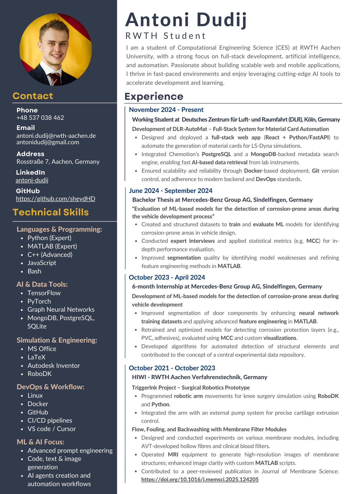
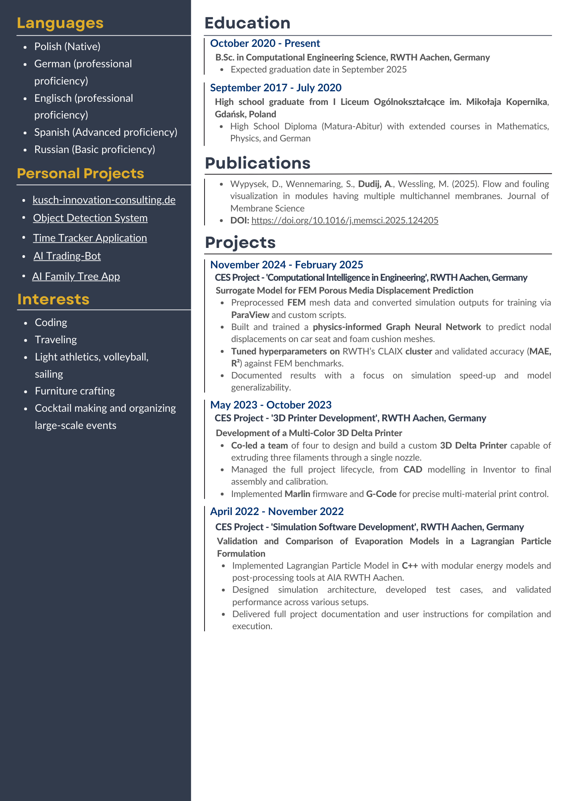
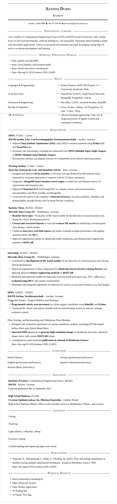

# Antoni Dudij - CV/Resume

## 📄 CV Pages

*Personal Information & Summary*

*Skills & Work Experience*

*Languages, Education & Interests*

*Publications & Personal Projects*

## 🖼️ Additional Images

*Antoni_Dudij_CV_English_new_1*

*Antoni_Dudij_CV_English_new_2*

*My_CV.drawio*

*output-combined*

*output*

---

## 📁 Repository Structure

This repository contains my professional CV/Resume in multiple formats:

- **LaTeX source files** (`template_1/` and `template_2/`)
- **PDF output** (`template_2/out/`)
  - [`main.pdf`](template_2/out/main.pdf)
- **PNG previews** (`attachments/png/`) - 9 files
- **LaTeX modules** (`modules/`) - 9 component files

---

## 🔄 Auto-Update

This README is automatically generated by GitHub Actions whenever the CV is updated.
The system detects changes in PNG files and automatically regenerates this documentation.

