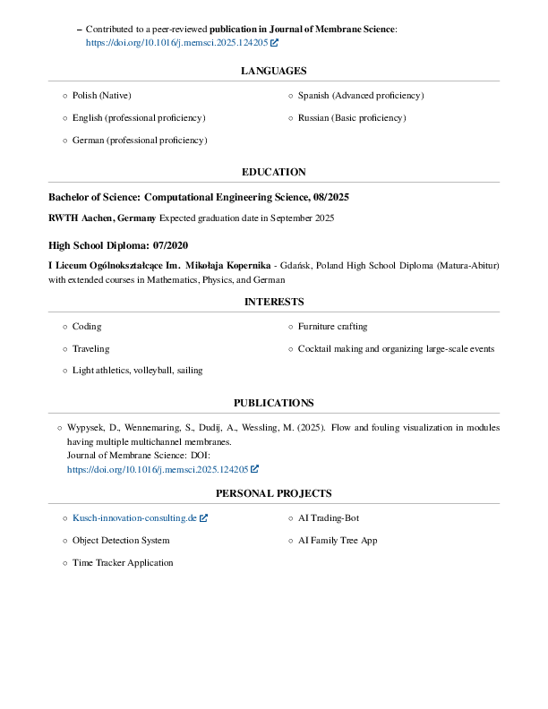

# Antoni Dudij - CV/Resume

## 📄 CV Pages

*Page 1 - Personal Information & Summary*

*Page 2 - Skills & Work Experience*

*Page 3 - Languages, Education & Interests*

*Page 4 - Publications & Personal Projects*

---

## 📁 Repository Structure

This repository contains my professional CV/Resume in multiple formats:
- **LaTeX source files** (`template_1/` and `template_2/`)
- **PDF output** (`template_2/out/main.pdf`)
- **PNG previews** (`attachments/png/`)

